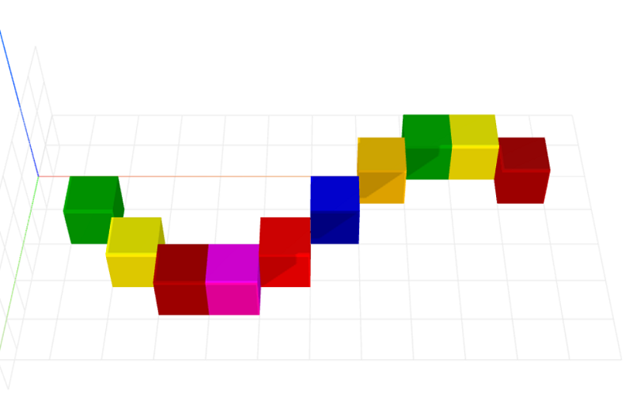

# wave-layout
Wave layout for CraftML

### Usage
```html
<craft>
    <craft name="wave-layout" module="wave-layout"/>
    <wave-layout></wave-layout>
</craft>
```

### Parameters
- height: adjusts wave height
- spacing: adjusts spacing of item arrangement

### Example
```html
<craft>
    <craft name="wave-layout" module="wave-layout"/>
    
    <wave-layout>
        <repeat n="10">
            <cube></cube>
        </repeat>
    </wave-layout> 

</craft>
```


